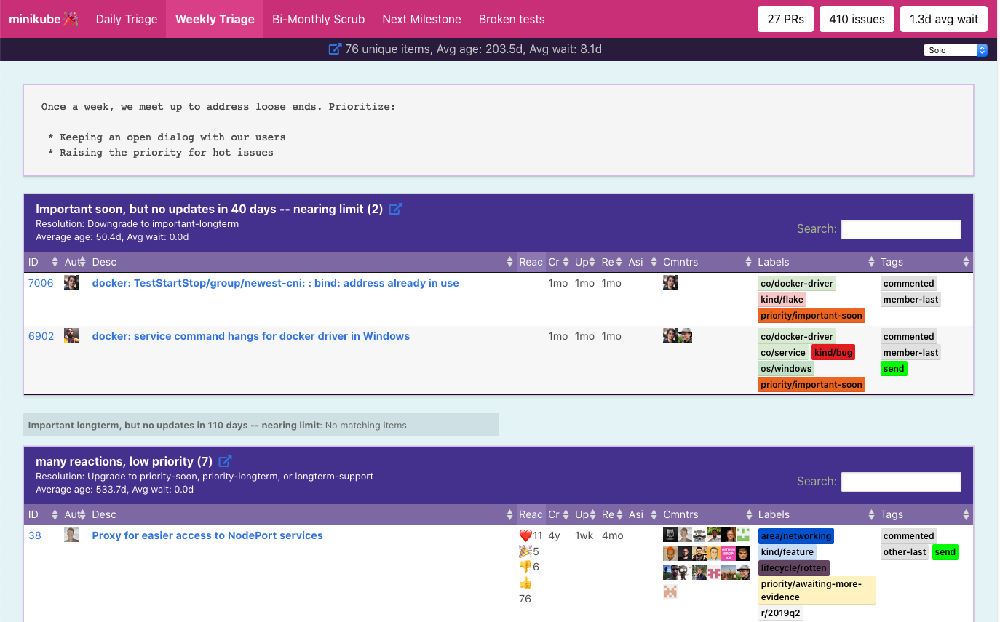
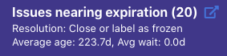
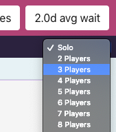
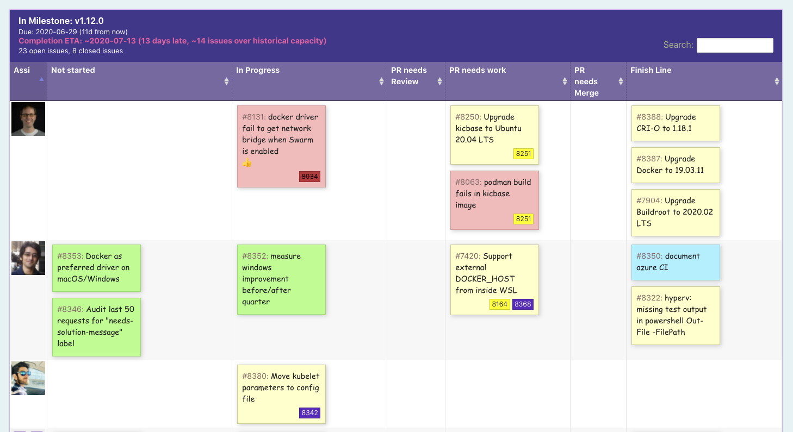
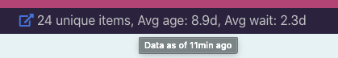

# Triage Party: massively multi-player GitHub triage 🎉

`NOTE: This is not an officially supported Google product`

Triage Party is a stateless web app to optimize issue and PR triage for large open-source projects using the GitHub API.



Triage Party focuses on reducing response latency for incoming GitHub issues and PR's, and ensure that conversations are not lost in the ether. It was built from the [Google Container DevEx team](https://github.com/GoogleContainerTools)'s experience contributing to popular open-source projects, such as [minikube](https://github.com/kubernetes/minikube), [Skaffold](https://github.com/GoogleContainerTools/skaffold/), and [Kaniko](https://github.com/GoogleContainerTools/kaniko/).

Triage Party is configured via YAML, and designed for projects to self-host on anything from a Raspberry Pi, Google Cloud Run, or Kubernetes.

<!-- START doctoc generated TOC please keep comment here to allow auto update -->
<!-- DON'T EDIT THIS SECTION, INSTEAD RE-RUN doctoc TO UPDATE -->
**Table of Contents**

- [Novel Features](#novel-features)
- [Triage Party in production](#triage-party-in-production)
- [Requirements](#requirements)
- [Try it](#try-it)
- [Usage Tips](#usage-tips)
- [Multi-player mode](#multi-player-mode)
- [Kanban mode (NEW)](#kanban-mode-new)
- [Data freshness](#data-freshness)
- [Documentation](#documentation)

<!-- END doctoc generated TOC please keep comment here to allow auto update -->

## Novel Features

* Multiplayer mode: Up to 20 simultaneous players in group triage
* Conversation direction tracking and filtering
* Query across GitHub projects or repositories
* Duplicate issue detection
* Filters that are not possible on GitHub:
  * Follow-up latency by project members (`responded: +15d`)
  * Reactions (`reactions: >=5`)
  * Comment popularity (`comments-per-month: >0.9`)
* Code review state-tracking (v1.2.0+)
* Kanban dashboard (v1.2.0+)
* Easily open groups of issues into browser tabs
* YAML configuration for all pages, rules, and filters
* GitHub Enterprise support (via `--github-api-url` cli flag)
* Low latency (yet able to pull live data)

## Triage Party in production

See these fine examples in the wild:

* [kubernetes/minikube](http://tinyurl.com/mk-tparty)
* [GoogleContainerTools/skaffold](http://tinyurl.com/skaffold-tparty)
* [jetstack/cert-manager](https://triage.build-infra.jetstack.net/)

## Requirements

* [GitHub API token](https://help.github.com/en/articles/creating-a-personal-access-token-for-the-command-line), with `public_repo` permissions (read-only)

## Try it

Store a GitHub token some place on disk:

`echo YOUR_GENERATED_TOKEN > $HOME/.github-token`

Run:

```shell
go run cmd/server/main.go \
  --github-token-file=$HOME/.github-token \
  --config config/examples/kubernetes.yaml \
  --repos kubernetes/sig-release
```

If you do not have [Go](https://golang.org/) installed, you can run Triage Party using Docker:

```shell
export GITHUB_TOKEN="$(cat $HOME/.github-token)"
docker build --tag=tp .
docker run \
  --rm \
  -e GITHUB_TOKEN \
  -v "$PWD/config/examples/kubernetes.yaml:/app/config/config.yaml" \
  -p 8080:8080 tp
```

You can also use Personal Access Token from [the GitHub CLI](https://github.com/cli/cli) to run the application:
```shell
export GITHUB_TOKEN=$(grep oauth_token ~/.config/gh/config.yml| cut -d ":" -f 2 | sed "s/ //g")
docker build --tag=tp .
docker run \
  --rm \
  -e GITHUB_TOKEN \
  -v "$PWD/config/examples/kubernetes.yaml:/app/config/config.yaml" \
  -p 8080:8080 \
  tp
```

You'll see logs emitted as Triage Party pulls content from GitHub. The first time a new repository is used, it will require some time (~45s in this case) to download the necessary data before minikube will render pages. Your new Triage Party site is now available at [http://localhost:8080/](http://localhost:8080/), but will initially block page loads until the required content has been downloaded. After the first run, pages are rendered from memory within ~5ms.

## Usage Tips

Triage Party can be configured to accept any triage workflow you can imagine. Here are some tips:



* Use the blue `box-with-arrow` icon to open issues/pull requests into a new tab
  * If nothing happens when clicked, your browser may be blocking pop-ups
  * The notification to allow-popups for Triage Party may be hidden in the URL bar.
* Rules work best when there is a documented resolution to remove it from the list
* Pages work best if the process is defined so that the page is empty when triage is complete
* If an non-actionable issue is shown as part of a daily or weekly triage, step back to tune your rules and/or define an appropriate resolution.

## Multi-player mode



Use the drop-down labelled `Solo` on the top-right of any page to enable multi-player mode. In multi-player mode, the number of issues are split among the number of players you have configured. Since Triage Party is state-less, players are assigned via the remainder of the issue or PR divided by the total number of players. Here is a workflow that we have seen work well for triage parties:

1. Wait for attendees to show up
1. The meeting host selects the appropriate number of players, and shares the resulting Triage Party URL
1. If someone is showing up later, we may leave a slot open and re-shard later if they do not appear
1. The meeting host assigns each attendee a player number
1. Players move section by section, using the "open items in new tabs" feature to quickly work through issues
1. When a player does not have the context necessary to resolve an item, they present their screen and discuss it with the other players
1. When a player leaves, the meeting host "re-shards", and all players select the updated player count in the drop-down

NOTE: Multi-player works best if the "Resolution" field of each rule has a clear action to resolve the item and remove it from the list.

## Kanban mode (NEW)



In v1.2.0, pages can now be displayed as a Kanban dashboard. The columns are based on the rule the issue was found in, and the rows are swim-lanes based on the assignee. To see a real-world example:

* [minikube kanban dashboard](http://tinyurl.com/minikube-kanban)
* [minikube kanban config](https://github.com/google/triage-party/blob/569782c961d66468e0def2d4f8b54acd104b02f4/config/examples/minikube.yaml#L111)

Best practices for designing a useful Kanban dashboard:

* Rules should be designed and ordered in a way that represents progress: `Not started` -> `Started` -> `Under Review` -> `Completed`
* Rules work best when they are mutually excusive (no issue matches multiple rules)
* If a collection should be displayed in Kanban form by default, specify `display: kanban` in its configuration.
* For velocity measurements and time estimate support, create a rule named `__velocity__` containing recently closed issues to include. See the example configuration.

## Data freshness



With the default `Dockerfile`, Triage Party refreshes data at least every 8 minutes, settable using the `--max-refresh` flag. Triage Party will give popular pages a higher refresh rate, up to every 30 seconds by default (settable using `--min-refresh` flag). This default is conservative, allowing Triage Party to work with repositories containing 10,000 open issues without hitting GitHub API limits.

Live data can be requested at any time by using forcing a refresh in their browser, typically by holding the Shift button as you reload the page. See   [forced refresh for your browser](https://en.wikipedia.org/wiki/Wikipedia:Bypass_your_cache#Bypassing_cache).

You can see how fresh a pages data is by mousing-over the "unique items" text in the top-center of the page.

## Documentation

Thirsting for more? See:

* [Configuration guide](docs/config.md)
* [Deployment guide](docs/deploy.md)
* [Persistent cache configuration](docs/persist.md)
