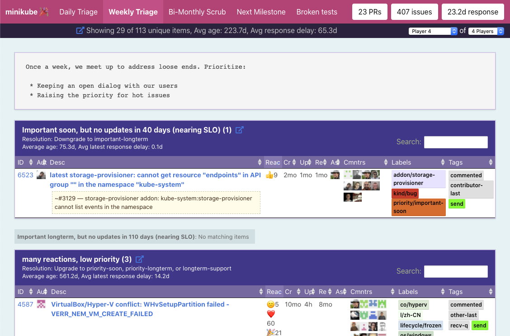

# Triage Party (UNDER CONSTRUCTION) 🎉
`NOTE: This is not an officially supported Google product`

Triage Party is a tool for triaging incoming GitHub issues, built with the GitHub API. 

It focuses on reducing response latency for incoming GitHub issues and PR's, and ensure that conversations are not lost in the ether. Triage Party was built from the Google Container DevEx team's experience contributing to open-source projects, such as minikube, kaniko, and skaffold. 

Triage Party is a stateless Go web application, configured via YAML. While it has been optimized for Google Cloud Run deployments, it's deployable anywhere due to it's low memory footprint: even on a Raspberry Pi.

Novel features:
* Shareable bookmarked GitHub queries
* Support for queries across multiple repositories
* Supports queries that are not possible on GitHub:
  * duration (`updated: +30d`)
  * conversation direction (`tag: recv`)
  * regexp (`label: priority/.*`)
  * reactions (`reactions: >=5`)
  * comment popularity (`comments-per-month: >0.9`)
  * ... and more!
* Multi-player mode: for simultaneous group triage of a pool of issues
* Button to open issue group as browser tabs
* High performance through agressive intelligent caching
* Supports "Shift-Reload" for live data pull

Production example: http://tinyurl.com/mk-tparty



## Requirements

- [GitHub API token](https://help.github.com/en/articles/creating-a-personal-access-token-for-the-command-line)
- Go v1.12 or higher

## Configuration

See `examples/minikube.yaml`

Supported filters:

```yaml
# issue state (default is "open")
- state:(open|closed|all)

- label: [!]regex
- tag: [!]regex

- milestone: string

- created: [-+]duration
- updated: [-+]duration
- responded: [-+]duration

- reactions: [><=]int
- reactions-per-month: [><=]float

- comments: [><=]int
- comments-per-month: [><=]int
- comments-while-closed: [><=]int

- commenters: [><=]int
- commenters-while-closed: [><=]int
- commenters-per-month: [><=]float
```

## Running locally

Start the webserver:

```
export GO111MODULE=on
cd cmd/server
go run main.go \
  --token $GITHUB_TOKEN \
  --config ../../examples/minikube.yaml
```

This will use minikube's configuration as a starting point. The first time you run Triage Party against a new repository, there will be a long delay as it will download and cache every issue and PR.

## Running in Docker

```
docker build --tag=tp --build-arg CFG=examples/minikube.yaml --build-arg TOKEN=$GITHUB_TOKEN 
docker run -p 8080:8080 tp
```

## Cloud Run Build & Deploy

See `examples/gcloud-deploy.sh`

Or use the easy button:

[](https://console.cloud.google.com/cloudshell/editor?shellonly=true&cloudshell_image=gcr.io/cloudrun/button&cloudshell_git_repo=http://github.com/google/triage-party)
